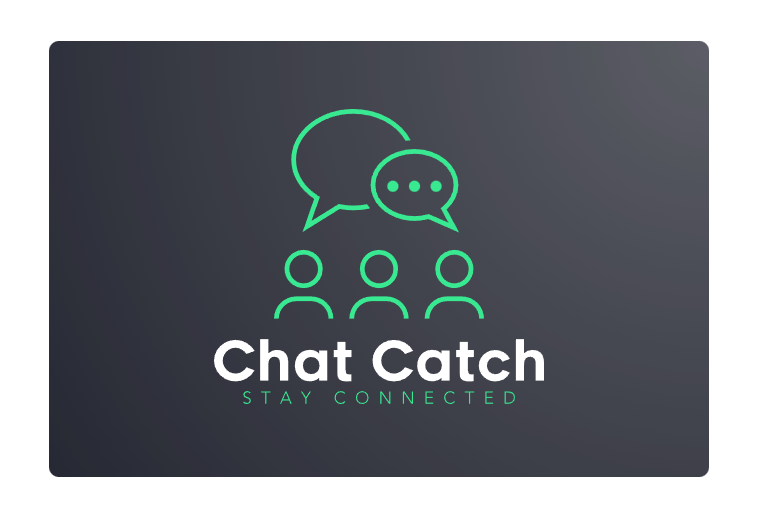
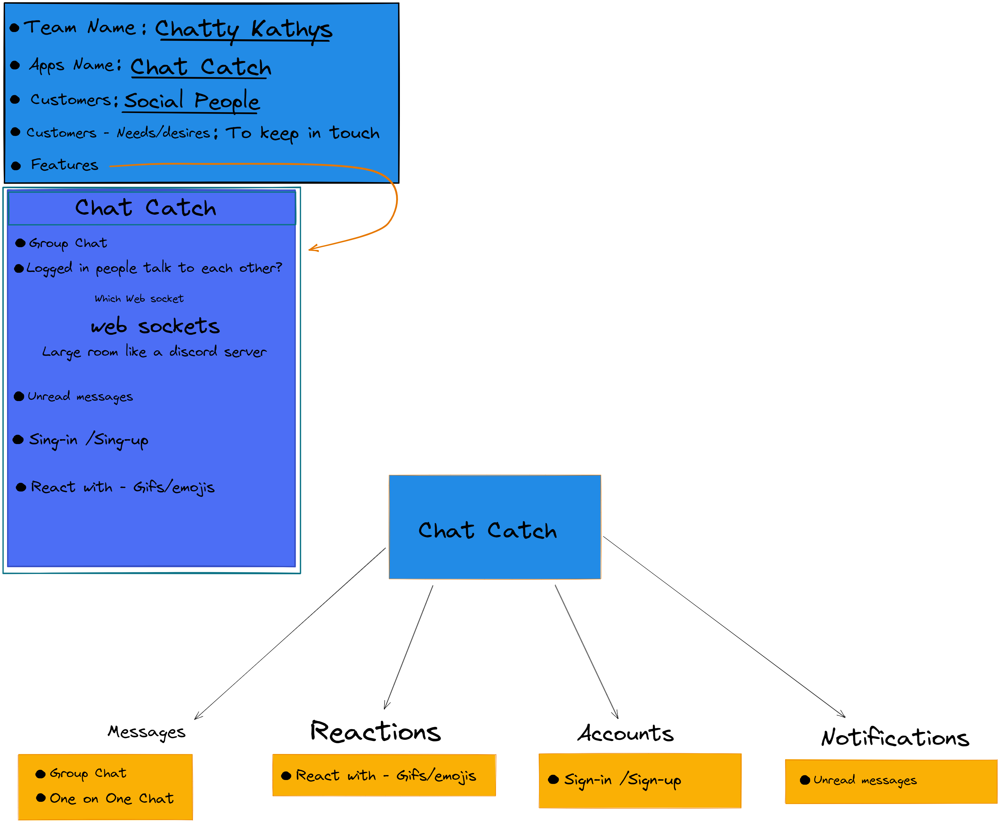
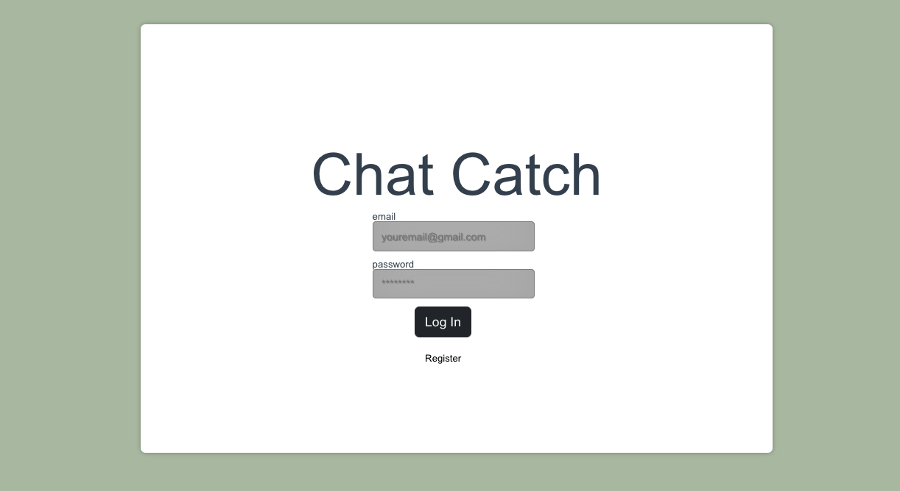
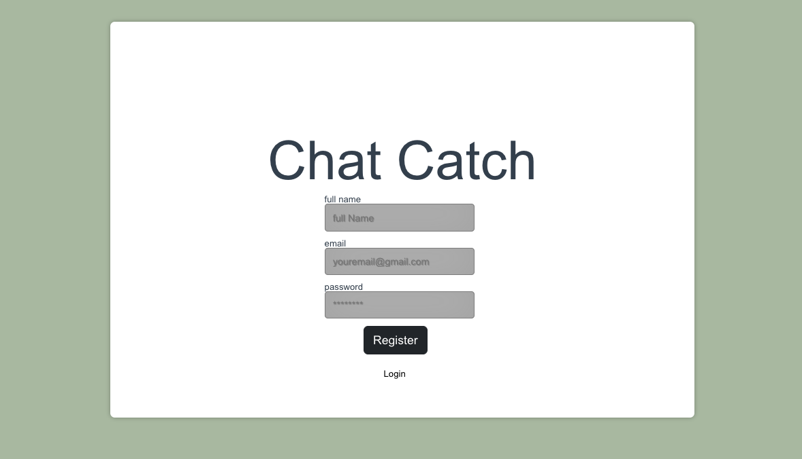
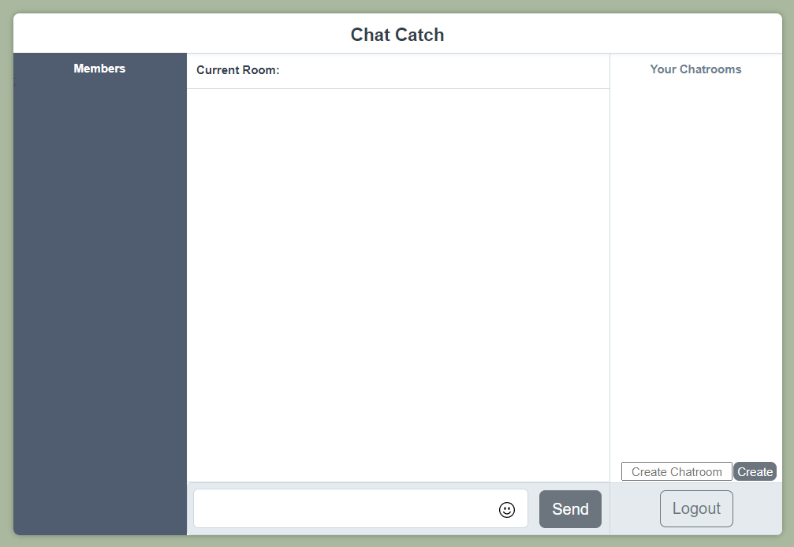

# Chat Catch
* Jared Greathouse
* Dean Reams
* Michael Mahurin
* Wenqi Jin

  
  

# What is Chat Catch?
* Chat Catch is intended for individuals who want a simple and easy-to-use chat website. This website is ideal for users who want to communicate with friends and family in real-time, as well as for users who want to join group chat rooms and participate in discussions of any topic with multiple users.
  
* The user-friendly design of Chat Catch makes it suitable for individuals of all ages and technical abilities. Whether you are a seasoned chat user or a beginner, Chat Catch offers a straightforward and intuitive interface that allows you to quickly and easily connect with other users and start chatting.

## OverView

  

## Login page

  

## SignUp page

  

## Chatroom

  

## Design
* [API design](./docs/apis.md)
* [GHI](./docs/ghi.md)

## Features of Chat Catch include:

* Real-time messaging: Chat Catch allows users to communicate in real-time with other users in their chat room.

* Group chat: Chat Catch allows users to create and join group chat rooms for multiple users to communicate in.

* User profiles: Chat Catch allows users to create a profile with a username and password for logging in and accessing their multiple chat rooms.

* Emoji support: Chat Catch allows users to use emojis in their messages for added expression.
  

## Future content / Planned additions

*  We plan on allowing users to select from a range of pre-defined reactions to posts and comments, such as a "thumbs up" or "heart" icon. This will add an additional layer of engagement and feedback for users.

* To support personalized accounts, we will allow users to create their own profiles with unique usernames and profile pictures. This will allow users to easily identify and connect with each other.

* In addition, we plan on implementing voice call functionality so that users can communicate with each other in real-time. This will enhance the sense of community and allow for more efficient communication.

## Project layout

#### GitLab pages URL

https://chatty-cathys.gitlab.io/chat-catch

#### Deploy it

https://chat-catch.onrender.com
